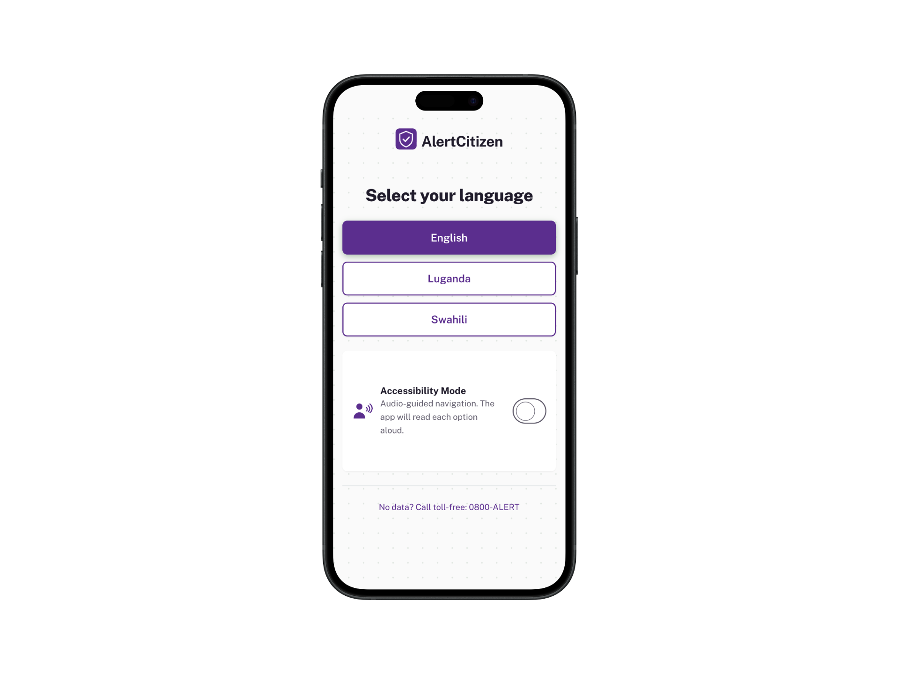
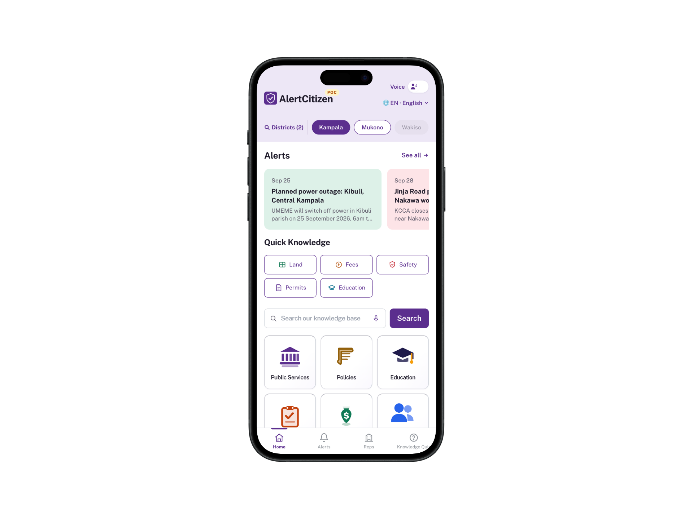
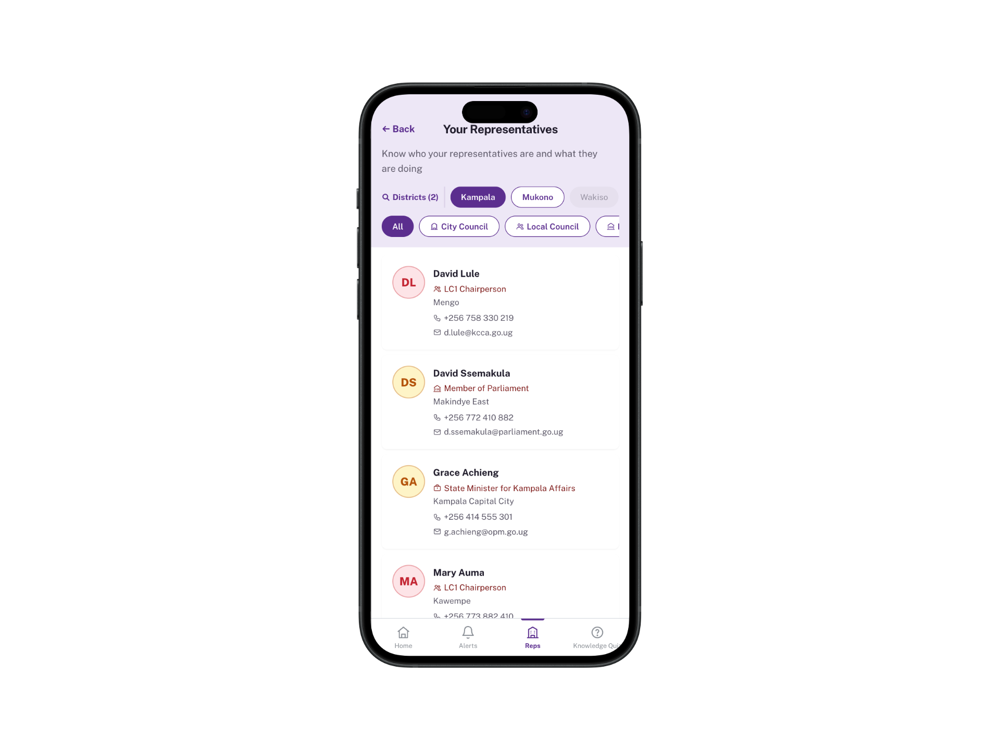
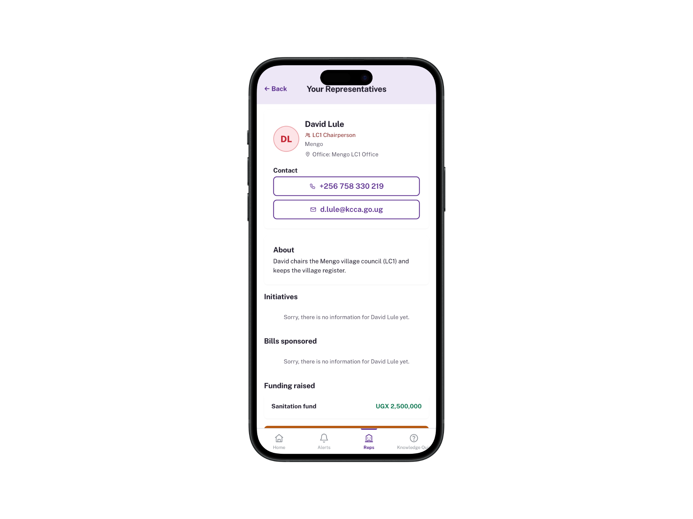

<p align="center">
  
</p>
<h1 align="center">AlertCitizen</h1>

     

## What is AlertCitizen?

Imagine you are told you must pay 200,000 shillings for an official stamp
— but the law says it costs 10,000. Or you are evicted from your home
because you don't know how the law protects you. Or the power company announces
an outage on a social network you never use, so your food goes bad and nobody
warned you.

AlertCitizen exists for moments like these. It is a small, fast phone app
that gives ordinary citizens **verified answers about civic life**: what
your local leaders are legally allowed to do, what official fees really
cost, where to go with a land dispute, how to stay safe — plus **alerts**
about power outages, road closures, and community events in your district.
Every answer shows its source, who verified it, and when it was last
updated. It works in **English, Luganda, and Swahili**, reads answers aloud
for people who prefer listening, and keeps working with **no internet**
once installed.

## What you can do in the app

- **Get alerts.** Power outages, water shutdowns, road works, and
  community events in your district, grouped by month with the exact
  times highlighted. Listen to any alert, share it, or copy it.
- **Ask questions.** Type a question or tap a shortcut (Land, Fees,
  Safety, Permits, Education). Answers come with the legal fee, the
  correct office to visit, warnings about illegal demands, and next steps.
  A guided chatbot helps you browse the knowledge base topic by topic.
- **Know your local council.** Pick your sub-county and see your
  actual local representatives, then open a profile for their duties,
  office location, contact details, initiatives, bills, and funding.
- **Meet your representatives.** Filter leaders by City Council, Local
  Council, MPs, and State Ministers, and take action from their profiles.
- **Take quizzes.** Short multiple-choice quizzes on local governance
  with an instant score. Rankings and leaderboards arrive in a later
  version.
- **Listen instead of reading.** Voice mode reads each topic aloud and
  lets you answer "Yes, continue", "Next", or "Stop Listening" — built
  for low-literacy users and anyone who prefers audio.
- **Enter by SMS.** Text `I NEED HELP` and get a link in your language.
  No app store, no account, no data needed to start.
- **Stay private.** Your data never leaves your phone. A "Delete all
  your data" button wipes everything locally.

## How it works (stack)

- **Next.js 14 static export** (`output: 'export'`) — the whole app
  compiles to plain HTML/CSS/JS in `out/`, so it can be hosted anywhere
  static files work. No servers, no databases, no API calls at runtime.
- **Preact on the client** (`react`/`react-dom` → `preact/compat`) plus
  **Tailwind CSS v3** and hand-rolled i18n — first-load JS is ~52–92KB
  per page, small enough for slow connections and basic phones.
- **Deterministic knowledge engine.** Questions are matched against a
  versioned JSON knowledge base (`data/` — laws, fees, mandates,
  districts) with keyword scoring. There is no generative model at
  runtime, so the app cannot invent fees, offices, or laws: if it
  doesn't know, it says so and points you to your LC1 or a toll-free
  line.
- **Offline-first PWA.** A hand-rolled service worker caches the app
  shell, the knowledge base, and your recent answers, with an offline
  fallback page.

## How AI was used

No generative AI runs inside the app — answers are retrieved, never
generated, which is exactly what makes them trustworthy. AI was used the
way a senior pair-programmer would be: to help design the information
architecture, draft and translate the trilingual interface and knowledge
content, build the UI components, and test flows across languages.
Every AI-assisted piece was reviewed, built, and verified by a human
before shipping.

## Run it locally

```bash
# Requires Node.js 22+
node --version

# Install (no native dependencies)
npm ci

# Develop (http://localhost:3000)
npm run dev

# Production static export (outputs to out/)
npm run build

# Preview the export
npx serve out

# Lint
npm run lint
```

## Demo in 5 minutes

1. **SMS entry.** Open `/sms-sim`, text `I NEED HELP` (or `NETAAGA
   OBUYAMBI`, or `SAIDIE`) and tap the reply link — it opens the app
   in the matching language.
2. **Ask.** On home, search `LC1 stamp fee asked 200000 UGX` and watch
   the red discrepancy banner fire on the result screen.
3. **Alerts.** Open Alerts, filter by Power, listen to an announcement,
   copy it with the copy button.
4. **Reps.** Open Your Representatives (or Know Your Local Council),
   filter by group, open a profile, check what the office can do.
5. **Quiz.** Take the Local Council quiz and see your score.
6. **Voice.** Flip the Voice toggle and let the app read the topics
   to you.

## Project structure

```text
pages/          Entry, home, result, complaint, announcements, quiz,
                lc-initiatives, sms-sim, 404 (+ _app shell)
lib/            matcher, i18n, sms-detect, speech, voice-walkthrough,
                complaint-store, version-check, quiz-engine,
                announcement-store, representatives-store,
                district-carousel, page-header, confirm-modal, qr
data/           national/*.json + districts/*.json + announcements,
                representatives, quizzes, rules, escalation,
                voice-tree, geography, sms-phrases (bundled at build)
public/         manifest.json, sw.js, icons, i18n/*.json,
                sms-sim/index.html, audio/manifest.json, offline.html
docs/           screenshots used above
scripts/        make-icons.mjs, generate-audio.mjs
```

## Notes and known limits (PoC)

- Filing complaints from result pages, representative ratings, and the
  report-an-error form are stubbed for later versions (their buttons
  say so and trigger no action).
- Luganda/Swahili audio falls back to an English "Language not
  available yet" line until native-speaker recordings land
  (`node scripts/generate-audio.mjs` prints the manifest + recipes).
- Sample representative contacts and demo quiz scores are placeholder
  data. Verify district/ministry source URLs and the `0800-ALERT`
  line before production.
- Luganda/Swahili copy is colloquial-draft quality — get a
  native-speaker pass before launch.
- `next dev` full page loads don't hydrate URL query params under
  Preact (client-side navigation and the production export handle
  them correctly).
